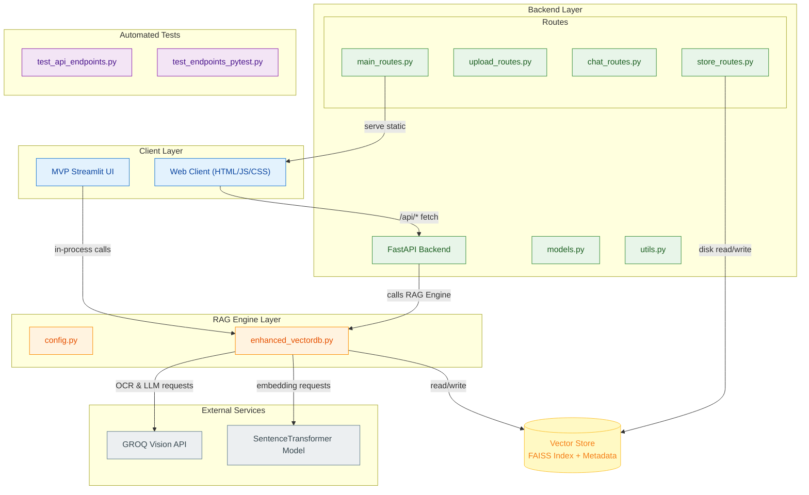

# RAG Chat Application - Documentation

A sophisticated Retrieval-Augmented Generation (RAG) chat application that enables intelligent conversations with your documents.

## 🏗️ Architecture Overview



## 📋 Quick Start

### Prerequisites
- Python 3.8+
- GROQ API key (for OCR and chat)

### Installation & Running
```bash
# Clone repository
git clone https://github.com/Jatin-Mehra119/wasserstoff-AiInternTask.git
cd wasserstoff-AiInternTask

# Install dependencies
pip install -r requirements.txt

# Run FastAPI backend (Production)
cd backend
python -m uvicorn main:app --host 0.0.0.0 --port 8000 --reload

# Open http://localhost:8000 in browser

# Alternative: Run Streamlit MVP
streamlit run streamlit_rag_app.py
```

## 🔧 Architecture Components

### Core RAG Engine (`rag_elements/`)
- **`enhanced_vectordb.py`** - Main RAG implementation with document processing, vector search, and AI integration
- **`config.py`** - Configuration management and settings

### FastAPI Backend (`backend/`)
- **`main.py`** - Application entry point and server configuration
- **`models.py`** - Pydantic data models and API schemas
- **`utils.py`** - Utilities, state management, and helpers
- **`routes/`** - Modular API endpoints:
  - `main_routes.py` - Frontend serving and health
  - `upload_routes.py` - Document upload and processing
  - `chat_routes.py` - Chat interface and AI responses
  - `store_routes.py` - Vector store persistence

### Frontend (`frontend/`)
- **`index.html`** - Main application UI
- **`style.css`** - Responsive design and styling
- **`script.js`** - Frontend logic and API integration

### Legacy MVP
- **`streamlit_rag_app.py`** - Original Streamlit implementation

## 📊 Data Flow

1. **Document Upload** → Text extraction → Chunking → Vector embeddings → FAISS index
2. **Chat Query** → Semantic search → Context retrieval → AI response generation → Citations
3. **Persistence** → Save/load vector stores with metadata

## 🔌 Key APIs

- `POST /upload-files` - Process documents
- `POST /chat` - Chat with documents
- `GET /stats` - Processing statistics
- `POST /save-vector-store` - Persist data
- `POST /load-vector-store` - Restore data

## 🧪 Testing

```bash
cd tests
bash run_tests.sh
```

## 📚 External Dependencies

- **FAISS** - Vector similarity search
- **GROQ** - Vision OCR and conversational AI
- **LangChain** - Document processing
- **FastAPI** - Web framework
- **Sentence Transformers** - Text embeddings

For detailed information, see the main [README.md](../README.md).
